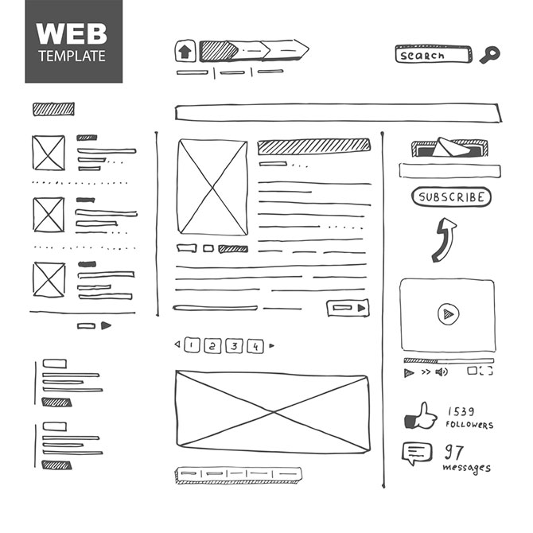
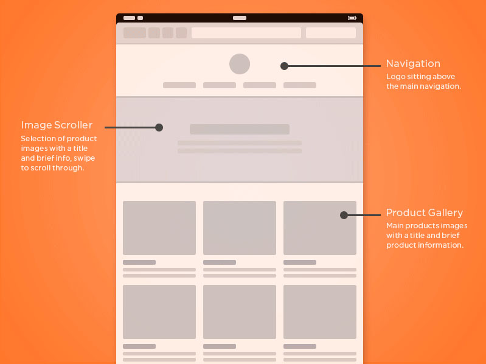
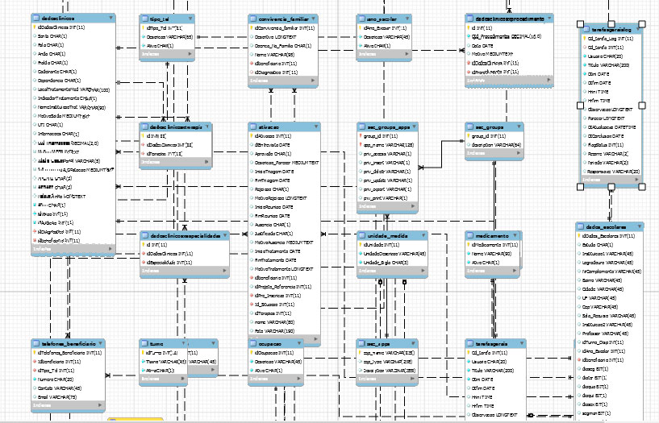

@div[left-50] 

@css[title](Análise de requisitos e desenvolvimento de sistemas)
@css[subtitulo](Construindo projetos de forma inteligente @css[orange]({}))
@divend

@div[left-50] 

@divend

---

@css[title](O modelo Goms)

@div[left-50] 
@ul
- @css[orange](G)oals: Objetivos
- @css[orange](O)perations: Operadores
- @css[orange](M)ethods: Metodos
- @css[orange](S)election Rules: Regras de seleção
@ulend
@divend

@div[left-50] 
 
@divend

---

@css[title](Documentação sistêmica)

@css[subtitulo](O ideal é que todos os projetos tenha uma documentação clara e objetiva)

@div[left-50] 
@ul[minurl]
- Detalhamento das ferramentas que serão usadas
- Layout sugerido, junto com as referências para desenvolvimento
- Detalhamento das páginas principais, as que tem muitos recursos
- Horas previsas para cada conjunto de informações
@ulend

@div[destaque] 
*As horas podem sofre modificação por conta do wireframe e do banco de dados*
@divend

@divend

@div[left-50] 

 @divend

---

@css[title](Wireframe de baixa fidelidade)

@css[subtitulo](É o rascunho, esboço inicial, pode até ser desenhado no papel)

---

@css[title](Wireframe de Media fidelidade)

@css[subtitulo](Não possui o layout pronto, e sim detalhamento das funcionalidades e posições)

---

@css[title](MER)

@css[subtitulo](Modelo de entidade relacional)
@css[subtitulo](@css[orange](Este é o coração do projeto, toda a interação do sistema passa e deve ser prevista no MER))

---

@css[title](O tempo é muito importante)

@div[left-50] 

@ul
- @css[orange](Calcule o tempo por recurso criado)
- @css[orange](Reaproveitamento de código)
- @css[orange](Documente todo o código)
@ulend

@divend

@div[left-50] 

@divend